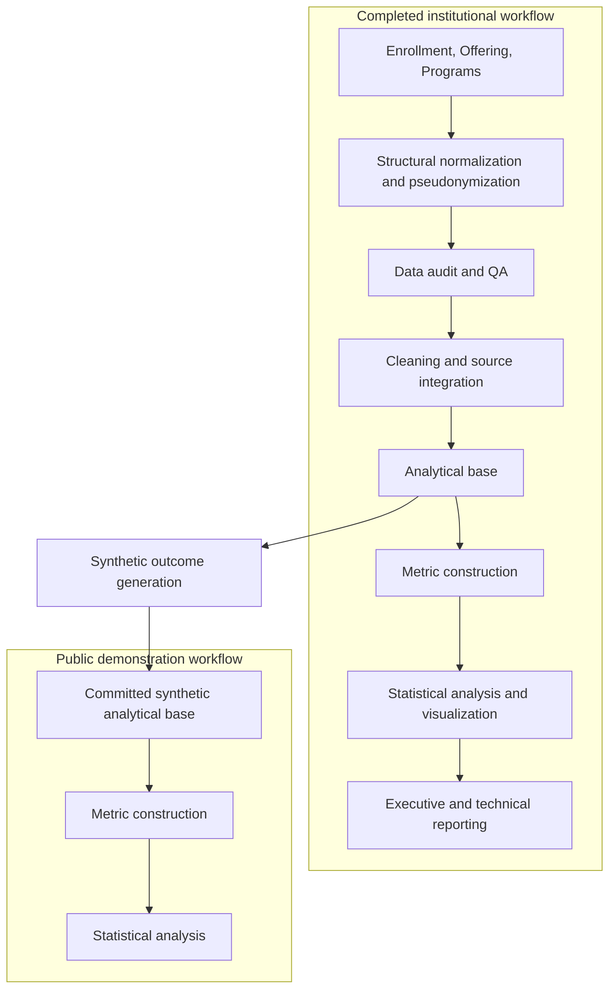

# Higher Education Outcomes Analysis

An end-to-end analytics project examining how academic completion outcomes vary across course sections, academic programs, delivery modes, and class shifts.

**Version 1.0** is the first complete, publishable release. It covers source-data validation, deterministic pseudonymization, data auditing, cleaning and integration, metric construction, statistical inference, visualization, synthetic public data, and professional reporting.

## The question

> **How do academic outcomes vary across course sections, academic programs, and instructional contexts?**

Version 1.0 examines **2024 C1**, one academic term at one institution. The unit of analysis is the **course section**: each observation contains aggregated enrollment outcomes and operational characteristics rather than student-level records.

## Version 1.0 highlights

- Three institutional source tables are normalized, pseudonymized, validated, and consolidated through explicit data contracts and relationship checks.
- Audit findings drive deterministic cleaning, enrollment reconciliation, and source-selection rules.
- The final analytical base contains **297 course sections**, **131 courses**, and **13 academic programs**.
- Reusable Python modules separate audit, cleaning, metric, validation, and reporting logic from notebook presentation.
- Statistical comparisons use confidence intervals, Welch's one-way ANOVA, Games–Howell follow-up tests, and partial eta-squared effect sizes.
- Five report figures, report-ready statistical tables, a technical report, and an executive summary communicate the completed analysis.
- Two committed synthetic analytical datasets support public execution of metric construction and statistical analysis.

## Workflow



The institutional workflow was completed first. The public demo adaptation was then generated from the private clean-base structure by replacing the five academic-outcome counts with deterministic synthetic values. See [Project architecture](docs/project_architecture.md) for stage interfaces and the exact public execution boundary.

## Analytical approach

The principal outcome is the section-level **completion rate**: promoted completions plus regular completions, divided by total enrollment. The analysis compares this measure by:

- Delivery mode: On-site, Online, and Hybrid;
- Shift: Morning, Afternoon, and Night;
- Academic program.

Welch's ANOVA addresses unbalanced groups without assuming equal variances. Significant omnibus results are followed by Games–Howell comparisons, and partial eta-squared distinguishes statistical evidence from practical magnitude. The shift × delivery-mode heatmap is descriptive; Version 1.0 does not estimate a formal interaction model. Detailed definitions and decision rules are documented in [Methodology](docs/methodology.md).

## Key findings

The reviewed institutional analysis produced the following results:

- Delivery mode was associated with completion, *p* = 0.0267, partial η² = 0.028. Hybrid sections had a lower mean than On-site sections; Hybrid and Online were not statistically distinguishable, and On-site and Online were nearly identical.
- Shift was associated with completion, *p* = 0.0048, partial η² = 0.036. Night sections had higher mean completion than Morning and Afternoon sections.
- Observed academic program means varied, but the omnibus comparison was not significant, *p* = 0.2901, partial η² = 0.043.
- The descriptive heatmap shows lower Hybrid completion concentrated in Morning and Afternoon cells, but this pattern was not tested as a formal interaction.

The statistically significant associations had small effect sizes. These findings are section-level associations from one academic term, not causal or student-level conclusions. The [Executive summary](reports/executive_summary.md) provides a two-minute overview, and the [Technical report](reports/technical_report.md) presents the full analytical narrative.

## Public reproducibility

The original institutional records and private intermediate datasets are not distributed. Version 1.0 publishes:

- `data/demo/demo_analytical_base.parquet`, the input to metric construction;
- `data/demo/demo_processed_data.parquet`, the metric-enriched input to analysis;
- the complete code for sanitization, audit, cleaning, metric construction, analysis, synthetic generation, and report-table generation;
- committed figures, statistical tables, and documentation.

The demo datasets preserve the pseudonymized section structure, total enrollment, and operational fields while replacing outcome counts. They make the final two notebooks publicly executable, but they do **not** provide synthetic raw Enrollment, Offering, and Programs tables and therefore do not enable public execution from source ingestion through cleaning. The [demo data card](data/demo/README.md) and [Data confidentiality](docs/confidentiality.md) document this boundary.

## Repository structure

```text
higher-education-outcomes-analysis/
├── data/
│   ├── raw/          # private institutional sources; not committed
│   ├── sanitized/    # private pseudonymized sources; not committed
│   ├── clean/        # private consolidated analytical base; not committed
│   ├── processed/    # private metric-enriched data; not committed
│   └── demo/         # public synthetic analytical datasets and data card
├── docs/             # architecture, methodology, limitations, version notes, confidentiality
├── notebooks/        # audit, cleaning, metric construction, and analysis
├── scripts/          # sanitized-data, synthetic-data, and report-table entry points
├── src/              # reusable pipeline and analytical modules
├── reports/
│   ├── figures/      # selected institutional result figures
│   ├── tables/       # report-ready and validation tables
│   ├── appendix/     # raw statistical and synthetic-validation outputs
│   ├── executive_summary.md
│   └── technical_report.md
└── requirements.txt
```

## Explore the project

For a time-efficient review:

1. Read the [Executive summary](reports/executive_summary.md).
2. Open the [Technical report](reports/technical_report.md) for the complete workflow and results.
3. Review `notebooks/04_analysis.ipynb` for the public demonstration analysis.
4. Inspect `notebooks/01_data_audit.ipynb` and `02_data_cleaning.ipynb` for the evidence behind the data-preparation decisions.
5. Explore `src/` and `scripts/` for the reusable implementation.

To run the public downstream workflow, install the dependencies and execute the last two notebooks in order:

```bash
python -m pip install -r requirements.txt
```

1. `notebooks/03_metric_construction.ipynb`
2. `notebooks/04_analysis.ipynb`

## Future versions

Version 1.0 is complete within its stated one-term, section-level scope. Future versions may extend it with additional academic periods, multivariable and interaction models, robustness analysis, and synthetic raw source tables that make the entire preparation pipeline publicly executable. See [Version notes and roadmap](docs/version_notes.md) for the prioritized extensions.

## Technology

Python, pandas, NumPy, SciPy, statsmodels, Pingouin, Matplotlib, Seaborn, Jupyter, and Parquet.

## Author

**Valentín Arias** — Data Science undergraduate, Universidad Nacional Guillermo Brown

## License

The project code is distributed under the terms in [LICENSE](LICENSE).
