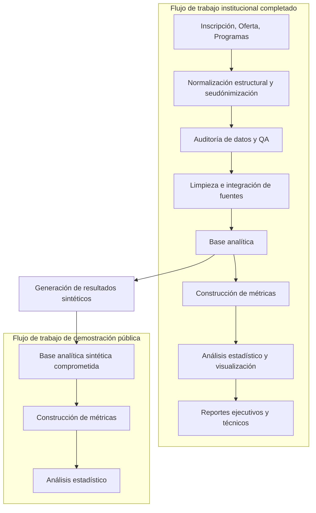

# Análisis de Resultados de Educación Superior

[📖 English version](README.md)

Un proyecto de análisis de extremo a extremo que examina cómo varían los resultados de finalización académica entre secciones de curso, programas académicos, modalidades de entrega y turnos de clase.

**Versión 1.0** es el primer lanzamiento completo y publicable. Abarca validación de datos fuente, seudónimización determinística, auditoría de datos, limpieza e integración, construcción de métricas, análisis estadístico y generación de reportes.

## La pregunta

> **¿Cómo varían los resultados académicos entre secciones de curso, programas académicos y contextos instruccionales?**

La Versión 1.0 examina **2024 C1**, un período académico en una institución. La unidad de análisis es la **sección de curso**: cada observación contiene resultados de matrícula agregados y características operacionales de la institución.

## Destacados de la Versión 1.0

- Tres tablas de fuentes institucionales se normalizan, seudonimizan, validan y consolidan a través de contratos de datos explícitos y verificaciones de relaciones.
- Los hallazgos de auditoría impulsan la limpieza determinística, la reconciliación de inscripción y reglas de selección de fuentes.
- La base analítica final contiene **297 secciones de curso**, **131 cursos** y **13 programas académicos**.
- Módulos Python reutilizables separan la lógica de auditoría, limpieza, métricas, validación y reporte de la presentación en cuadernos.
- Las comparaciones estadísticas utilizan intervalos de confianza, ANOVA de una vía de Welch, pruebas de seguimiento Games–Howell y tamaños de efecto eta-cuadrada parcial.
- Cinco figuras de informe, tablas estadísticas listas para informe, un informe técnico y un resumen ejecutivo comunican el análisis completado.
- Dos conjuntos de datos analíticos sintéticos comprometidos soportan la ejecución pública de construcción de métricas y análisis estadístico.

## Flujo de trabajo



El flujo de trabajo institucional fue completado primero. La adaptación de demostración pública fue generada luego a partir de la estructura de base limpia privada reemplazando los cinco conteos de resultados académicos con valores sintéticos calibrados.

## Enfoque analítico

El resultado principal es la **tasa de finalización** a nivel de sección: finalizaciones promovidas más finalizaciones regulares, dividido por inscripción total. El análisis compara esta medida por:

- Modalidad de entrega: Presencial, En línea e Híbrida;
- Turno: Mañana, Tarde y Noche;
- Programa académico.

ANOVA de Welch aborda grupos desbalanceados sin asumir varianzas iguales. Los resultados omnibus significativos son seguidos por comparaciones Games–Howell, y eta-cuadrada parcial distingue significancia estadística de relevancia práctica.

## Hallazgos principales

El análisis institucional revisado produjo los siguientes resultados:

- La modalidad de entrega se asoció con finalización, *p* = 0,0267, η² parcial = 0,028. Las secciones híbridas tuvieron una media menor que las secciones presenciales; híbrida y en línea no fueron estadísticamente distinguibles.
- El turno se asoció con finalización, *p* = 0,0048, η² parcial = 0,036. Las secciones de noche tuvieron mayor finalización promedio que las secciones de mañana y tarde.
- Las medias observadas de programas académicos variaron, pero la comparación omnibus no fue significativa, *p* = 0,2901, η² parcial = 0,043.
- El mapa de calor descriptivo muestra menor finalización híbrida concentrada en celdas de mañana y tarde, pero este patrón no fue probado como una interacción formal.

Las asociaciones estadísticamente significativas tenían tamaños de efecto pequeños. Estos hallazgos son asociaciones a nivel de sección de un período académico, no conclusiones causales o a nivel de estudiante. Ver el [resumen ejecutivo](reports/executive_summary.md) para consideraciones de generalización e implicaciones.

## Reproducibilidad pública

Los registros institucionales originales y los conjuntos de datos intermedios privados no se distribuyen. La Versión 1.0 publica:

- `data/demo/demo_analytical_base.parquet`, la entrada para construcción de métricas;
- `data/demo/demo_processed_data.parquet`, la entrada enriquecida con métricas para análisis;
- el código completo para sanitización, auditoría, limpieza, construcción de métricas, análisis, generación sintética y generación de tablas de informe;
- figuras, tablas estadísticas y documentación comprometidas.

Los conjuntos de datos de demostración preservan la estructura de sección seudónimizada, inscripción total y campos operacionales mientras reemplazan los conteos de resultados. Hacen que los últimos dos cuadernos sean públicamente ejecutables, pero producen resultados sintéticos, no institucionales.

## Estructura del repositorio

```text
higher-education-outcomes-analysis/
├── data/
│   ├── raw/          # fuentes institucionales privadas; no comprometidas
│   ├── sanitized/    # fuentes seudónimizadas privadas; no comprometidas
│   ├── clean/        # base analítica consolidada privada; no comprometida
│   ├── processed/    # datos enriquecidos con métricas privados; no comprometidos
│   └── demo/         # conjuntos de datos analíticos sintéticos públicos y tarjeta de datos
├── docs/             # arquitectura, metodología, limitaciones, notas de versión, confidencialidad
├── notebooks/        # auditoría, limpieza, construcción de métricas y análisis
├── scripts/          # puntos de entrada para datos sanitizados, datos sintéticos y tablas de informe
├── src/              # módulos pipeline y analíticos reutilizables
├── reports/
│   ├── figures/      # figuras de resultados institucionales seleccionadas
│   ├── tables/       # tablas listas para informe y validación
│   ├── appendix/     # resultados estadísticos brutos y salidas de validación sintética
│   ├── executive_summary.md
│   └── technical_report.md
└── requirements.txt
```

## Explorar el proyecto

Para una revisión eficiente en tiempo:

1. Lee el [Resumen ejecutivo](reports/executive_summary.md).
2. Abre el [Informe técnico](reports/technical_report.md) para el flujo de trabajo completo y resultados.
3. Revisa `notebooks/04_analysis.ipynb` para el análisis de demostración pública.
4. Inspecciona `notebooks/01_data_audit.ipynb` y `02_data_cleaning.ipynb` para la evidencia detrás de las decisiones de preparación de datos.
5. Explora `src/` y `scripts/` para la implementación reutilizable.

Para ejecutar el flujo de trabajo público descendente, instala las dependencias y ejecuta los últimos dos cuadernos en orden:

```bash
python -m pip install -r requirements.txt
```

1. `notebooks/03_metric_construction.ipynb`
2. `notebooks/04_analysis.ipynb`

## Versiones futuras

La Versión 1.0 está completa dentro de su alcance declarado de un período de término y a nivel de sección. Las versiones futuras pueden extenderla con períodos académicos adicionales, modelos multivariables e de interacción, análisis de robustez y estratificación institucional.

## Tecnología

Python, pandas, NumPy, SciPy, statsmodels, Pingouin, Matplotlib, Seaborn, Jupyter y Parquet.

## Autor

**Valentín Arias** — Estudiante de grado en Data Science, Universidad Nacional Guillermo Brown

## Licencia

El código del proyecto se distribuye bajo los términos en [LICENSE](LICENSE).
