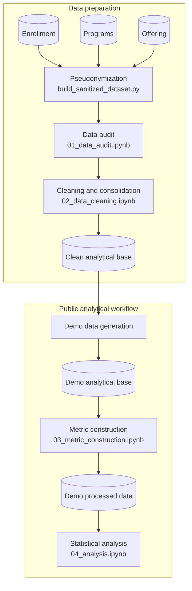

# Project Architecture

The project is organized as a staged analytical pipeline rather than a collection of independent notebooks. Narrative analysis stays in Jupyter, while reusable transformations and validation logic live in Python modules.

## System overview

The committed demo artifacts provide the input required to run metric construction and analysis. Earlier preparation stages remain visible through their notebooks, scripts, and reusable modules.

## Source relationships

| Source | Role | Integration key |
|---|---|---|
| Enrollment | Primary section-level enrollment and outcome counts | `course_code`, `section` |
| Offering | Canonical operational metadata | `course_code`, `section` |
| Programs | Program descriptors | `program_code` |

The cleaning stage joins these sources into one row per retained course section.

## Component map

| Component | Role in the project |
|---|---|
| `scripts/build_sanitized_dataset.py` | Runs source loading, structural normalization, pseudonymization, validation, and export. |
| `src/pipeline/` | Implements reusable ingest, normalization, sanitization, validation, and export operations. |
| `src/auditing.py` | Provides schema, missingness, duplication, key, relationship, and consistency checks. |
| `src/cleaning.py` | Provides categorical normalization, taxonomy mapping, reconciliation, and integration helpers. |
| `src/metric_construction.py` | Builds aggregate outcome counts and normalized rates. |
| `src/synthetic/` | Generates the public demo outcome counts. |
| `notebooks/` | Presents the analytical workflow, evidence, visualizations, and interpretation. |
| `data/demo/` | Stores the committed inputs for the public analytical stages. |

Audit, cleaning, and metric construction use notebooks backed by reusable modules. Statistical analysis is implemented directly in its notebook, while pseudonymization and demo generation use script entry points.

## Stage interfaces

| Stage | Input | Implementation | Output |
|---|---|---|---|
| Pseudonymization | Three source tables | `build_sanitized_dataset.py`, `src/pipeline/` | Three sanitized Parquet files |
| Audit | Sanitized tables | `01_data_audit.ipynb`, `src/auditing.py` | Data-quality assessment |
| Cleaning | Sanitized tables | `02_data_cleaning.ipynb`, `src/cleaning.py` | `data/clean/analytical_base.parquet` |
| Demo generation | Clean analytical base | `src/synthetic/generate_demo_dataset.py` | `data/demo/demo_analytical_base.parquet` |
| Metric construction | Demo analytical base | `03_metric_construction.ipynb`, `src/metric_construction.py` | `data/demo/demo_processed_data.parquet` |
| Analysis | Demo processed data | `04_analysis.ipynb` | Statistical tables and visualizations |

## Public execution

| Stage | Included implementation | Runnable from committed data |
|---|---:|---:|
| Pseudonymization | Yes | No |
| Audit | Yes | No |
| Cleaning | Yes | No |
| Demo generation | Yes | No |
| Metric construction | Yes | Yes |
| Statistical analysis | Yes | Yes |

This separation allows the repository to show the complete preparation design while providing an immediately runnable analytical path. The [demo data card](../data/demo/README.md) describes the public inputs, and [confidentiality.md](confidentiality.md) summarizes the data-publication boundary.
