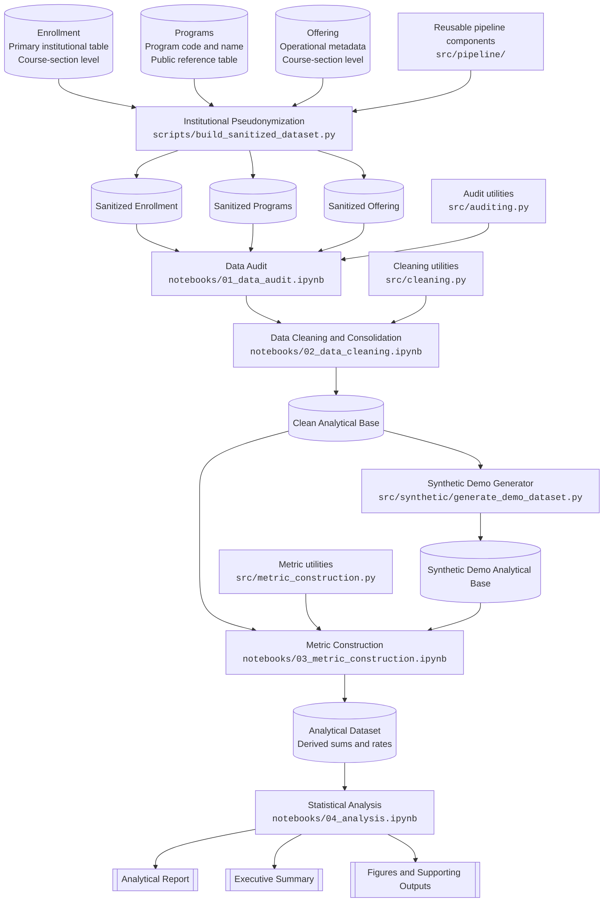
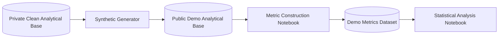
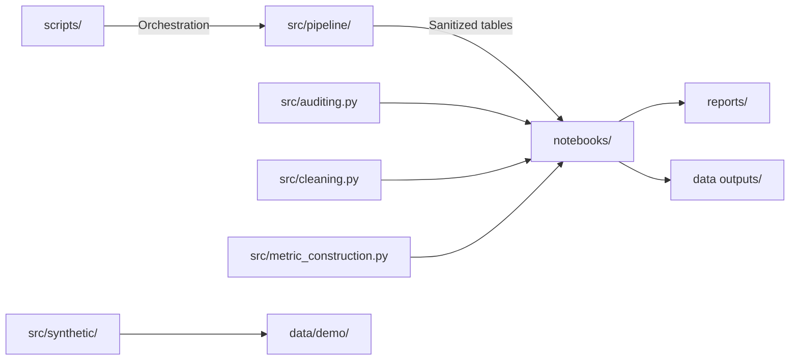

# Project Architecture

## Overview

This project implements an end-to-end analytical workflow for higher-education outcomes using institutional data subject to confidentiality restrictions.

The architecture is designed around three principles:

1. **Institutional identifiers are pseudonymized before any exploratory output is produced.**
2. **Each analytical stage is implemented through a notebook supported by reusable Python modules.**
3. **Public reproducibility is provided through synthetic demo data, while the original institutional datasets remain private.**

---

## End-to-End Workflow



---

## Source Data

The workflow begins with three source tables.

### Enrollment

The primary institutional dataset.

- Unit of observation: **course section**
- Contains enrollment totals and academic outcome counts
- Includes some operational fields, but more than half of the values are missing for several variables later completed from the offering table

### Programs

A public reference table containing:

- program code
- program name

It is used to enrich and validate program-level information.

### Offering

A support table containing operational metadata at the **course-section level**, including:

- weekday
- campus
- schedule time
- shift
- delivery mode

This table complements the enrollment dataset because the corresponding fields in the primary source contain substantial missingness.

---

## 1. Institutional Pseudonymization

Pseudonymization is the first processing stage and occurs **before data auditing**.

This design allows the audit and cleaning notebooks to display real structural and quality issues without exposing institutional entities.

The following identifiers are pseudonymized:

- campus names
- course names and codes
- program names and codes

### Implementation

```text
scripts/build_sanitized_dataset.py
        │
        └── src/pipeline/
```

The script orchestrates the pseudonymization pipeline, while `src/pipeline/` contains the reusable transformations and mappings.

### Output

Three sanitized source tables are produced:

- sanitized enrollment
- sanitized programs
- sanitized offering

These sanitized tables become the inputs to the public-facing notebooks.

---

## 2. Data Audit

The audit stage evaluates the sanitized source tables before any corrective transformation is applied.

### Implementation

```text
notebooks/01_data_audit.ipynb
        │
        └── src/auditing.py
```

### Main responsibilities

- schema inspection
- data type review
- missing-value profiling
- duplicate detection
- categorical consistency checks
- key and relationship validation
- assessment of overlap and inconsistencies across enrollment, programs and offering

The audit notebook documents the actual problems found in the institutional data while preserving confidentiality through prior pseudonymization.

---

## 3. Data Cleaning and Consolidation

The cleaning stage transforms the audited inputs into a coherent analytical base.

### Implementation

```text
notebooks/02_data_cleaning.ipynb
        │
        └── src/cleaning.py
```

### Main responsibilities

- normalization of text and categorical values
- correction of inconsistent labels
- type conversion
- treatment of missing values
- integration of program reference data
- completion of operational metadata using the offering table
- consolidation of the three sanitized source tables
- validation of enrollment and outcome-count consistency

### Output

```text
data/clean/analytical_base.parquet
```

The resulting dataset contains one row per course section with the cleaned academic and operational variables required for downstream analysis.

---

## 4. Metric Construction

The metric-construction stage converts cleaned counts into analytical indicators.

### Implementation

```text
notebooks/03_metric_construction.ipynb
        │
        └── src/metric_construction.py
```

### Main responsibilities

- construction of completion totals
- construction of non-completion totals
- calculation of completion rates
- calculation of promoted and regular completion rates
- calculation of dropout, insufficient and free-status rates
- validation of sums, ranges and internal metric consistency

### Output

The exported analytical dataset is the direct input to the statistical analysis notebook.

---

## 5. Statistical Analysis

The final notebook uses the analytical dataset to investigate differences in academic outcomes across institutional dimensions.

### Implementation

```text
notebooks/04_analysis.ipynb
```

### Analytical scope

- preliminary dataset characterization
- descriptive statistics
- confidence intervals
- group comparisons
- effect-size estimation
- post hoc analysis where required
- interpretation of findings and limitations

The analysis is organized around research questions involving:

- delivery mode
- shift
- academic program

---

## 6. Public Reproducibility with Synthetic Data

The original institutional datasets and the clean analytical base cannot be distributed.

To allow public execution of the downstream workflow, the repository includes a synthetic demo generator.

### Implementation

```text
src/synthetic/generate_demo_dataset.py
```

### Synthetic workflow



The demo dataset preserves:

- the public schema
- the course-section structure
- pseudonymized entities
- logical constraints
- the qualitative relationships examined in the analysis

It contains no original observations.

---

## Repository Responsibilities



| Component | Responsibility |
|---|---|
| `scripts/` | Entry points that orchestrate full processing tasks |
| `src/pipeline/` | Reusable pseudonymization and dataset-building logic |
| `src/auditing.py` | Data-quality inspection utilities |
| `src/cleaning.py` | Cleaning, standardization and consolidation utilities |
| `src/metric_construction.py` | Derived analytical metrics |
| `src/synthetic/` | Synthetic demo-data generation |
| `notebooks/` | Narrative execution of the analytical workflow |
| `data/` | Private, clean and public demo datasets according to stage |
| `reports/` | Technical and executive communication of results |
| `docs/` | Methodology, architecture, limitations and version documentation |

---

## Reproducibility Boundary

The repository intentionally distinguishes between **visible implementation** and **publicly executable stages**.

| Stage | Code visible | Publicly executable | Reason |
|---|---:|---:|---|
| Pseudonymization | Yes | No | Requires private institutional source data |
| Data audit | Yes | No | Requires sanitized derivatives of private source data |
| Data cleaning | Yes | No | Requires sanitized source tables |
| Synthetic generation | Yes | No | Requires the private clean analytical base |
| Metric construction | Yes | Yes | Uses the public synthetic demo base |
| Statistical analysis | Yes | Yes | Uses metrics derived from synthetic demo data |

This boundary is deliberate. It preserves the complete implementation for technical review while preventing redistribution of protected institutional data.

---

## Architectural Summary

The project is not a collection of isolated notebooks. It is a staged analytical system in which:

1. source tables are pseudonymized before inspection;
2. audit and cleaning logic are separated into reusable modules;
3. the three source tables are consolidated into a course-section analytical base;
4. analytical metrics are created and validated in a dedicated stage;
5. statistical analysis consumes the exported metric dataset;
6. synthetic data provides public reproducibility for the downstream workflow;
7. technical and executive reports communicate the results and their limitations.
