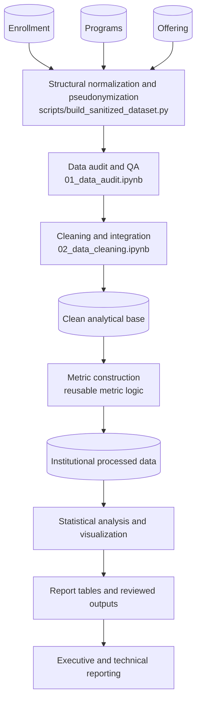
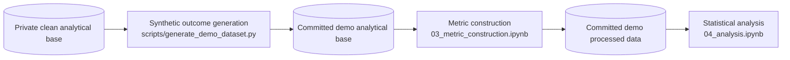

# Project Architecture

## Version 1.0 architecture

Version 1.0 is organized as a completed staged analytical pipeline rather than a collection of independent notebooks. Narrative evidence remains in Jupyter, while reusable ingestion, sanitization, auditing, cleaning, metric, validation, and reporting logic lives in Python modules and scripts.

The repository contains two related workflows: the completed institutional analysis and a public demonstration path that begins at the synthetic analytical-base stage.

### Institutional workflow

The institutional workflow is complete through reporting. Its source records, pseudonymization mappings, sanitized tables, clean base, and processed row-level data remain private.

### Public demo adaptation

After validating the institutional analysis, `scripts/generate_demo_dataset.py` was added to create public demonstration data. The generator reads the private clean analytical base, preserves its pseudonymized section structure and operational attributes, and replaces the five academic-outcome counts with deterministic synthetic values.

The committed demo artifacts allow a visitor to rerun metric construction and statistical analysis. They preserve the qualitative conclusions used for demonstration, while their means, confidence intervals, test statistics, effect sizes, and p-values differ from the reviewed institutional results.

## Source relationships

| Source | Role | Integration key |
|---|---|---|
| Enrollment | Primary section-level enrollment and outcome counts | `course_code`, `section` |
| Offering | Canonical operational metadata | `course_code`, `section` |
| Programs | Academic program descriptors | `program_code` |

The cleaning stage joins these sources into one row per retained course section. Offering is the canonical source for workload, campus, weekday, schedule time, shift, and delivery mode because the corresponding Enrollment fields are substantially incomplete.

## Component map

| Component | Role in Version 1.0 |
|---|---|
| `scripts/build_sanitized_dataset.py` | Loads the three private sources, normalizes their columns, pseudonymizes identifiers, validates row counts and keys, and exports sanitized Parquet files. |
| `src/pipeline/` | Implements reusable ingestion, normalization, sanitization, validation, and export operations. |
| `src/auditing.py` | Provides schema, missingness, duplication, key, relationship, and outcome-consistency checks. |
| `src/cleaning.py` | Provides categorical normalization, taxonomy mapping, enrollment reconciliation, and integration helpers. |
| `src/metric_construction.py` | Builds aggregate outcome counts and normalized rates. |
| `scripts/generate_demo_dataset.py` | Generates deterministic synthetic outcome counts and exports the public demo analytical base and validation summaries. |
| `scripts/generate_report_tables.py` | Exports raw institutional statistical results, report-ready inferential summaries, explicitly prefixed `demo_*` descriptives, and original-versus-synthetic validation tables. |
| `notebooks/` | Presents the audit, preparation, feature-engineering, visualization, inference, and interpretation workflow. |
| `data/demo/` | Stores the two committed inputs for the public downstream analytical stages. |
| `reports/figures/` | Stores five selected figures from the reviewed institutional analysis. |
| `reports/tables/` | Stores institutional inferential summaries, public demo descriptives prefixed `demo_*`, and original-versus-synthetic validation tables; its README identifies the source and intended use of each table. |

Audit, cleaning, and metric construction use notebooks backed by reusable modules. Statistical analysis and visualization are implemented directly in `04_analysis.ipynb`; report-table export and demo generation use script entry points.

## Stage interfaces

| Stage | Input | Implementation | Output |
|---|---|---|---|
| Sanitization | Three private source tables | `scripts/build_sanitized_dataset.py`, `src/pipeline/` | Three private sanitized Parquet files |
| Audit | Sanitized tables | `01_data_audit.ipynb`, `src/auditing.py` | Executed data-quality assessment |
| Cleaning and integration | Sanitized tables | `02_data_cleaning.ipynb`, `src/cleaning.py` | `data/clean/analytical_base.parquet` |
| Institutional metric construction | Private clean base | Reusable logic in `src/metric_construction.py`, applied in the completed institutional workflow | `data/processed/processed_data.parquet` |
| Demo generation | Private clean base | `scripts/generate_demo_dataset.py` | `data/demo/demo_analytical_base.parquet` |
| Public metric construction | Demo analytical base | `03_metric_construction.ipynb`, `src/metric_construction.py` | `data/demo/demo_processed_data.parquet` |
| Public analysis | Demo processed data | `04_analysis.ipynb` | Executed statistical outputs and visualizations in the notebook |
| Report-table export | Private and demo analytical artifacts | `scripts/generate_report_tables.py`, `src/reporting.py` | `reports/tables/` and `reports/appendix/statistical_outputs/` |
| Reporting | Reviewed tables and figures | Markdown reports | `reports/executive_summary.md`, `reports/technical_report.md` |

## Public execution boundary

| Stage | Implementation included | Runnable from committed data |
|---|---:|---:|
| Source ingestion and sanitization | Yes | No |
| Audit | Yes | No |
| Cleaning and integration | Yes | No |
| Synthetic demo generation | Yes | No |
| Metric construction | Yes | Yes |
| Statistical analysis | Yes | Yes |
| Report-table export | Yes | No |

The first four stages require private institutional inputs or the private clean base. Version 1.0 therefore exposes the complete implementation for review but provides immediate public execution only from the committed synthetic analytical base onward. The [demo data card](../data/demo/README.md) describes the public inputs, and [Data confidentiality](confidentiality.md) defines the publication boundary.

## Future public architecture

A future release may add synthetic raw Enrollment, Offering, and Programs tables so that every stage can run publicly:

**synthetic raw sources → sanitization → audit → cleaning and integration → analytical base → metric construction → analysis → reporting**

This is an extension beyond the complete Version 1.0 scope, not a capability of the current demo data. Prioritized analytical and reproducibility extensions are maintained in [Version notes and roadmap](version_notes.md).
