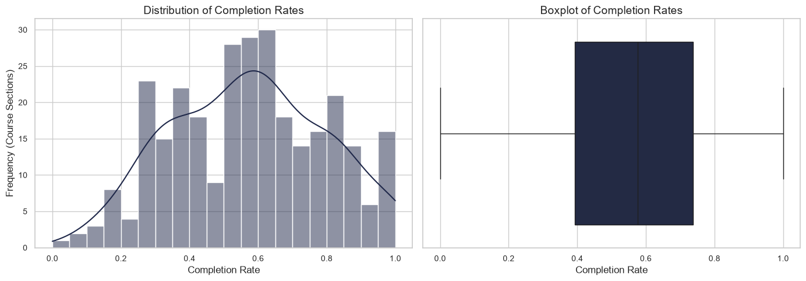
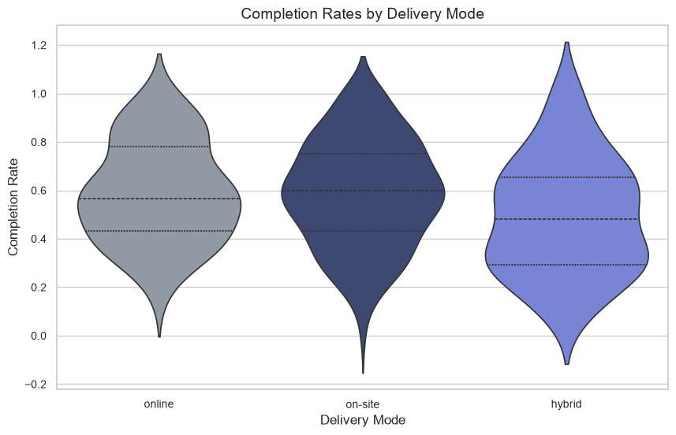
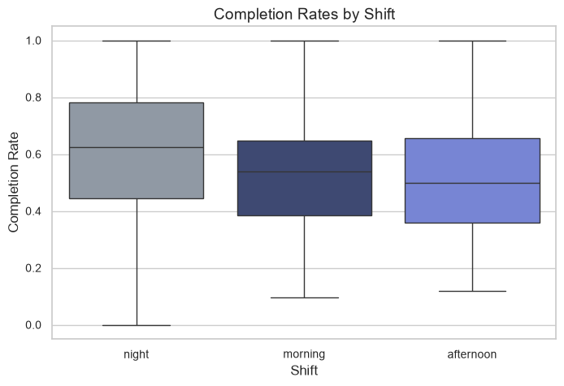
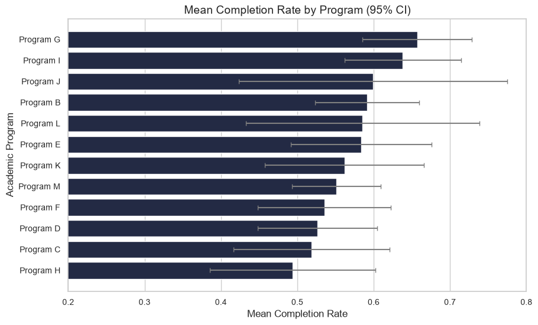
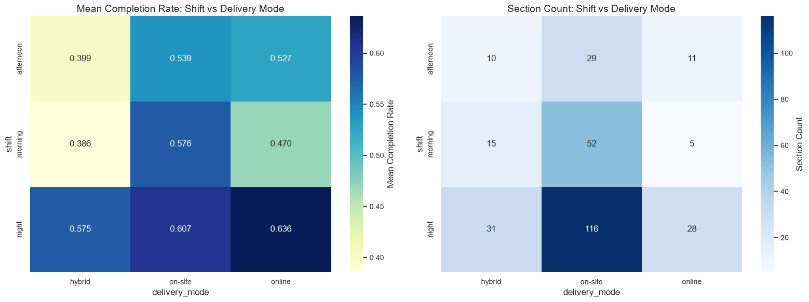

# Higher Education Outcomes Analysis

## Technical report on course-section completion outcomes, 2024 C1

This report synthesizes the implemented analytical pipeline and the reviewed results produced from the institutional dataset. The original records are not distributed publicly. The repository instead includes a synthetic dataset that preserves the pseudonymized course-section structure and supports public execution of metric construction and statistical analysis. Because the synthetic outcomes are generated, their exact descriptive and inferential estimates differ from the institutional estimates reported here.

## 1. Executive Overview

This project examines how academic completion outcomes vary across course sections and instructional contexts during **2024 C1**, one academic term at one institution. The analytical unit is the **course section**, not the individual student. Each retained observation combines aggregate enrollment outcomes with course, academic program, schedule, delivery mode, workload, and campus information.

The work addresses a practical data problem as much as a statistical one. Three source tables—Enrollment, Offering, and Programs—had to be structurally normalized, pseudonymized, audited, reconciled, and joined before comparison was reliable. Enrollment contained the outcome counts but had substantially incomplete operational fields. Offering therefore became the canonical source for scheduling and delivery metadata, while Programs supplied the academic program descriptor. Of 303 sanitized Enrollment records, 297 matched Offering and formed the final analytical base.

The principal outcome is `completion_rate`: promoted completions plus regular completions, divided by total enrollment in the section. The analysis summarizes its distribution and compares it across delivery modes, shifts, and academic programs. Welch's one-way ANOVA was used because the groups are unbalanced and equal variances were not assumed. Significant omnibus results were followed by Games–Howell comparisons; residual checks and partial eta-squared were reported alongside the tests. A shift-by-delivery view was retained as descriptive exploration rather than treated as a tested interaction.

The reviewed institutional results show statistically supported but small differences by delivery mode and shift. On-site and Online sections had nearly identical mean completion rates, while Hybrid sections had a lower mean; the statistically supported pairwise difference was Hybrid versus On-site, not Hybrid versus Online. Night sections had higher mean completion than Morning and Afternoon sections. Observed academic program means varied, but the omnibus program comparison was not significant. These findings are section-level associations from one term and do not identify causal effects.

## 2. Problem and Analytical Scope

The core analytical question is: **How do academic outcomes vary across course sections, academic programs, and instructional contexts?** The project evaluates four applied questions:

1. What is the overall distribution of section-level completion rates?
2. Are completion rates associated with delivery mode?
3. Are completion rates associated with class shift?
4. Is the observed variation across academic programs greater than would be expected from sampling variability?

A fifth view examines the pattern formed by shift and delivery mode together. It is exploratory and descriptive because the implemented analysis does not fit a formal interaction model.

The study covers **2024 C1** only. A row represents one course section identified by `course_code` and `section`, with student outcomes already aggregated into counts. The analysis therefore characterizes differences between sections; it neither estimates individual student risk nor tracks students over time. Its scope also excludes causal attribution, institutional policy evaluation, longitudinal trends, instructor effects, and adjustment for student-level background or prior achievement.

## 3. Data Sources and Analytical Dataset

Three structurally related sources were required:

| Source | Role in the analysis | Integration key |
|---|---|---|
| Enrollment | Primary section-level source for total enrollment and five final academic-outcome counts | `course_code`, `section` |
| Offering | Canonical operational source for workload, campus, weekday, schedule time, shift, and delivery mode | `course_code`, `section` |
| Programs | Reference source for academic program names | `program_code` |

Enrollment contains counts for dropout, insufficient performance, free status, promoted completion, and regular completion. Although it also contained operational fields, those fields were populated for only about two-fifths of rows. Offering supplied complete operational metadata and was therefore necessary to create a consistent section-level base. Programs contributed one stable program label for each program code.

After integration, the analytical base contains 297 course sections, 131 courses, and 13 academic programs. Section counts across delivery modes and shifts are preserved in the public synthetic data. Outcome values are not: the public generator retains the pseudonymized structure, operational attributes, and total enrollment, then replaces the five outcome counts using a fixed random seed and checks that the generated counts sum to enrollment in every row.

The generated public dataset summary is shown below. It provides reproducible descriptive context for the committed demo files; institutional outcome estimates used in the results section are identified separately.

| Public demo dataset metric | Value |
|---|---:|
| Course sections | 297 |
| Academic programs | 13 |
| Courses | 131 |
| Total enrollment across sections | 13,090 |
| Median section enrollment | 46 |
| Mean completion rate | 0.566 |
| Median completion rate | 0.554 |
| Standard deviation | 0.208 |
| Range | 0.000–1.000 |

The public artifacts are `data/demo/demo_analytical_base.parquet`, the input to metric construction, and `data/demo/demo_processed_data.parquet`, the metric-enriched input to analysis. They are the official demonstration datasets for the public workflow. Their 297 rows, program and course counts, total enrollment, and delivery-mode and shift composition match the institutional analytical structure, while their generated academic outcomes do not reproduce confidential row-level results.

## 4. Data Preparation Workflow

The implemented sequence is:

**source tables → structural normalization → institutional pseudonymization → data audit → cleaning and standardization → source integration → analytical base → metric construction → statistical analysis**

The public adaptation begins after the private analytical base: generated outcome counts produce a demo analytical base, after which the same metric logic and analysis notebook can be run publicly.

### 4.1 Data audit

The audit established that all three sources had usable schemas and unique natural keys. Enrollment contained 303 unique `(course_code, section)` combinations, Offering contained 305, and Programs contained 13 unique program codes. No full-row duplicates were found, and course-code/course-name and program-code/program-name mappings were internally one-to-one.

The material quality issue was operational missingness in Enrollment. Shift, weekday, schedule time, and delivery mode were each missing in 181 of 303 records (59.74%); campus was missing in 186 records (61.39%). By contrast, Offering had no missing values in its audited fields. Using the partial operational values from Enrollment would therefore have produced inconsistent coverage and competing sources for the same attributes. The audit evidence supports the decision to use Offering as the canonical operational source.

Offering also contained categorical fragmentation. Before cleaning it had six observed shift labels, 14 weekday labels, and 26 delivery-mode labels, including differences in case, whitespace, spelling, and mixed on-site/remote descriptions. These were not treated as distinct analytical categories. Workload was stored as a floating-point field even though all observations were integer-valued.

Relational checks found 297 Enrollment–Offering key matches, six Enrollment keys without Offering metadata, and eight Offering keys without Enrollment outcomes. Enrollment and Programs had complete referential coverage. Four Enrollment rows also had small additive inconsistencies: the sum of their five outcome components was one or two students below reported total enrollment. No negative outcome counts or zero-enrollment sections were detected.

### 4.2 Cleaning and standardization

The source builder first trims and maps source column names to a consistent English `snake_case` schema. It then applies deterministic pseudonymization before analytical inspection: course codes, program codes, and campuses receive stable public identifiers; course names are derived from pseudonymized course codes; and program names become generic labels such as Program A. Private mappings remain outside the public repository.

During cleaning, the sparse operational columns were removed from Enrollment because Offering was selected as their canonical source. Offering text was trimmed, converted to lowercase, stripped of accents, and normalized for repeated whitespace. Explicit typo maps then consolidated known variants. Shift was reduced to Morning, Afternoon, and Night; delivery mode to On-site, Online, and Hybrid; and weekday to six canonical weekday labels. Residual delivery descriptions that consistently combined on-site and remote hours were classified as Hybrid. Workload was converted to a nullable integer type.

For the four additive inconsistencies, the pipeline retained reconciliation flags and replaced reported total enrollment with the sum of the five outcome components because the absolute difference was within the implemented tolerance of two. This preserves a denominator that is consistent with the mutually exhaustive outcome counts used to construct rates. Temporary diagnostic columns were removed before export, while `is_reconciled` and `reconciled_enrollment_diff` remained in the private clean base for traceability.

### 4.3 Source integration

Cleaned Offering metadata was joined to Enrollment on the validated composite key `(course_code, section)`. The unique-key checks support a one-to-one merge and protect against accidental row multiplication. The initial left join retained 303 Enrollment rows, six of which had no matched operational record. Only two of those six retained any partial operational information in Enrollment, and the project did not implement a secondary-source fallback. All six were excluded to keep the operational fields complete and sourced consistently.

Program descriptors were then joined by `program_code`. This relationship had full audited coverage. The integrated dataset contained 297 rows and 19 fields at this stage, with no duplicate section keys and no missing values in the final fields.

### 4.4 Analytical base

The analytical base represents one retained course section with reconciled enrollment totals, five outcome counts, pseudonymized course and academic program identifiers, and canonical operational metadata. Before metric construction, the workflow validated row count, key uniqueness, missingness, data types, reconciliation outputs, and source-merge integrity. The base therefore provides a stable denominator and a consistent set of grouping variables for downstream comparisons.

## 5. Metric Construction

The central outcome is the proportion of enrolled students in a section whose final status was either promoted completion or regular completion:

$$
\text{completion\_rate} =
\frac{\text{promoted\_completion\_count} + \text{regular\_completion\_count}}
{\text{total\_enrollment}}
$$

The numerator is first stored as `completion_count`. The denominator is the reconciled total enrollment, so the rate is comparable across sections of different sizes. All retained sections have positive enrollment; sections are not weighted by enrollment in the reported group analyses, meaning each course section contributes one observation regardless of its size.

The pipeline also constructs `attrition_count` as dropout plus free-status outcomes, and `adverse_outcomes_count` as dropout plus insufficient outcomes plus free-status outcomes. Component and aggregate counts are divided by total enrollment to produce corresponding rates. `excellence_ratio` is promoted completions divided by all completions; it describes the composition of successful outcomes rather than the share of all enrolled students and is represented as zero when a section has no completions.

Post-construction checks confirm that generated metrics are complete, nonnegative where applicable, bounded between zero and one, and additively consistent. In particular, `completion_rate` equals the sum of promoted and regular completion rates, and the five outcome counts sum to total enrollment row by row.

## 6. Dataset Characterization

In the reviewed institutional analytical data, the mean section-level completion rate was 0.571 and the standard deviation was 0.224. Rates spanned the full bounded range from 0 to 1. The corresponding public demo values are 0.566 and 0.208, respectively. The close overall location and preserved structure support demonstration of the workflow, but the synthetic values should not be substituted for the institutional estimates.

*Figure 1. Distribution and boxplot of section-level completion rates in the reviewed institutional analysis.*

Figure 1 shows broad section-to-section dispersion around the center of the distribution, including observations near both bounds. This variation motivates group comparison, while the bounded outcome and unequal group sizes argue against relying on a conventional equal-variance ANOVA without qualification.

The dataset is also compositionally unbalanced. On-site accounts for 197 sections, compared with 56 Hybrid and 44 Online sections. Night accounts for 175 sections, compared with 72 Morning and 50 Afternoon sections. Academic program counts range from 3 to 44 sections; Program A, with only three sections, is retained in general dataset summaries but excluded from program-level inference under the implemented minimum of ten sections.

## 7. Statistical Methodology

The analysis uses `completion_rate` as the dependent variable and a two-sided significance threshold of **α = 0.05**.

**Confidence intervals.** The overall mean is summarized with a Student's *t* confidence interval. Group plots use approximate 95% intervals computed as the group mean ± 1.96 standard errors. These intervals communicate estimation uncertainty and are not treated as substitutes for the omnibus tests.

**Welch's one-way ANOVA.** Separate models compare delivery mode, shift, and academic program. Welch's test addresses whether at least one group mean differs while not requiring equal variances; this is appropriate for the visibly unbalanced factor groups and the project's decision not to assume variance homogeneity. Programs with fewer than ten sections are excluded from the program model, leaving 12 academic programs.

**Games–Howell comparisons.** When a Welch omnibus test is significant, Games–Howell pairwise comparisons identify which group pairs are statistically distinguishable. The method is consistent with unequal variances and unequal sample sizes. No program post hoc test was performed because the program omnibus test was not significant.

**Residual diagnostics.** Shapiro–Wilk tests are applied to residuals from one-factor ordinary least-squares models. In the reviewed institutional results, delivery-mode residuals showed a statistically significant departure from normality (*W* = 0.990, *p* = 0.0390); shift (*W* = 0.991, *p* = 0.0738) and program residuals (*W* = 0.991, *p* = 0.0808) did not. These are diagnostics, not a mechanical pass/fail rule or the sole reason for selecting Welch's method. The large section count, inspection of the outcome distribution, group imbalance, and use of a heteroscedastic procedure are considered together.

**Effect size.** Partial eta-squared accompanies each omnibus result. The reporting convention labels values below 0.01 negligible, 0.01–0.059 small, 0.06–0.139 medium, and 0.14 or greater large. These labels describe magnitude independently of statistical significance.

**Shift-by-delivery analysis.** Mean completion and section count are cross-tabulated for the nine shift-by-delivery cells. Because no factorial or interaction model was implemented, this view is used only to identify descriptive patterns and sparse cells that may motivate later analysis.

## 8. Results

All inferential values in this section come from the reviewed institutional report tables under `reports/tables/` and their raw counterparts under `reports/appendix/statistical_outputs/`. The figures also represent the reviewed institutional analysis. Public notebook execution produces the same analytical sequence on synthetic outcomes and therefore yields different numerical estimates.

### 8.1 Delivery mode

**Question.** Are mean section-level completion rates associated with delivery mode?

| Delivery mode | Sections | Mean completion rate | Approx. 95% CI |
|---|---:|---:|---:|
| On-site | 197 | 0.589 | 0.558–0.619 |
| Online | 44 | 0.590 | 0.530–0.650 |
| Hybrid | 56 | 0.493 | 0.431–0.555 |

*Figure 2. Institutional completion-rate distributions by delivery mode; internal lines show distribution quartiles.*

Online and On-site section means were effectively identical, while the Hybrid mean was about 9.6–9.7 percentage points lower. Welch's ANOVA supported a difference among the three means, *F*(2, 91.31) = 3.769, *p* = 0.0267, partial η² = 0.028. The effect is small: the factor is statistically associated with the outcome, but most section-level variation remains outside this one-factor grouping.

Games–Howell comparisons locate the supported difference more narrowly:

| Comparison | Mean difference | *p* | Hedges' *g* | Interpretation |
|---|---:|---:|---:|---|
| On-site − Online | −0.001 | 0.9992 | −0.006 | No statistically significant difference |
| Hybrid − On-site | −0.096 | 0.0232 | −0.424 | Hybrid lower than On-site |
| Hybrid − Online | −0.097 | 0.0783 | −0.429 | No statistically significant difference |

The evidence therefore supports a Hybrid–On-site difference, but not a Hybrid–Online difference at α = 0.05, despite their similar observed mean gap. It also provides no evidence of a difference between Online and On-site delivery. These are associations among sections and do not establish that delivery mode caused the observed outcomes.

### 8.2 Shift

**Question.** Are mean section-level completion rates associated with class shift?

| Shift | Sections | Mean completion rate | Approx. 95% CI |
|---|---:|---:|---:|
| Morning | 72 | 0.529 | 0.480–0.578 |
| Afternoon | 50 | 0.508 | 0.450–0.566 |
| Night | 175 | 0.606 | 0.572–0.639 |

*Figure 3. Institutional completion-rate distributions by class shift.*

Night sections had the highest observed mean, approximately 7.6 percentage points above Morning and 9.7 points above Afternoon. Welch's ANOVA supported variation across shifts, *F*(2, 119.15) = 5.583, *p* = 0.0048, partial η² = 0.036. As with delivery mode, the estimated effect is small.

| Comparison | Mean difference | *p* | Hedges' *g* | Interpretation |
|---|---:|---:|---:|---|
| Afternoon − Morning | −0.021 | 0.8515 | −0.099 | No statistically significant difference |
| Morning − Night | −0.076 | 0.0350 | −0.341 | Morning lower than Night |
| Afternoon − Night | −0.097 | 0.0154 | −0.434 | Afternoon lower than Night |

Games–Howell results support differences between Night and both daytime shifts. Morning and Afternoon were not statistically distinguishable. The analysis cannot determine whether this pattern reflects scheduling itself, differences in the students or courses assigned to each shift, or other unmeasured factors.

### 8.3 Academic program

**Question.** Is observed mean completion variation statistically supported across academic programs with adequate section counts?

The analysis included the 12 programs with at least ten sections and excluded Program A (*n* = 3). Within the eligible set, observed institutional means ranged from 0.494 for Program H (approximate 95% CI 0.386–0.602; *n* = 17) to 0.657 for Program G (0.585–0.729; *n* = 29). Other program estimates and their uncertainty are shown in Figure 4.

*Figure 4. Institutional academic program means and approximate 95% confidence intervals for programs with at least ten sections.*

Despite visible differences in point estimates, Welch's ANOVA was not significant, *F*(11, 91.66) = 1.213, *p* = 0.2901, partial η² = 0.043. The effect-size estimate is labeled small, but the current data do not provide sufficient statistical evidence that program means differ. No Games–Howell comparisons were run. The result should not be described as proof that all academic programs have equal outcomes, nor should the plotted means be treated as a definitive performance ranking.

### 8.4 Shift and delivery-mode pattern

**Question.** How do mean completion rates vary descriptively across combinations of shift and delivery mode?

*Figure 5. Institutional cell means (left) and section counts (right) for shift × delivery mode.*

The descriptive cell means show lower completion for daytime Hybrid sections: 0.399 in Afternoon (*n* = 10) and 0.386 in Morning (*n* = 15). Night Hybrid sections averaged 0.575 (*n* = 31), closer to the other Night cells: 0.607 for On-site (*n* = 116) and 0.636 for Online (*n* = 28). Morning Online was the smallest cell (*n* = 5) and averaged 0.470; Afternoon On-site and Online averaged 0.539 and 0.527, respectively.

This pattern is consistent with the overall Hybrid difference being concentrated in daytime schedules, but it is not a statistically tested interaction. The cell sizes are highly unequal—ranging from 5 to 116 sections—so the smallest-cell means are especially uncertain. The heatmap is best read as a hypothesis-generating view for a future factorial or multilevel model.

## 9. Discussion

The strongest supported pattern is not a broad hierarchy across all groups. Instead, the evidence is selective. On-site and Online sections have nearly identical mean completion, while Hybrid sections are lower overall; post hoc evidence supports Hybrid versus On-site but does not reach the significance threshold for Hybrid versus Online. Night sections are higher than both Morning and Afternoon sections, which do not differ from each other. Academic program point estimates vary, yet the program-level omnibus test is not significant.

Both significant factors have small partial eta-squared values: 0.028 for delivery mode and 0.036 for shift. Their statistical signals are therefore meaningful for describing this dataset but limited as explanations of overall section-level variation. The wide completion distribution and small effects indicate that unmodeled course, section, instructor, cohort, and student composition may matter substantially.

Group imbalance affects both precision and interpretation. Most sections are On-site and at Night, while Online, Hybrid, Morning, and Afternoon groups are smaller. The shift-by-delivery cells are more uneven still. Welch's and Games–Howell methods accommodate unequal variances and sample sizes, but they cannot supply missing covariates or turn sparse cells into precise estimates.

The daytime Hybrid pattern may reflect scheduling friction, differences in course mix, student selection, or another operational feature. Likewise, higher Night completion may reflect the composition of students or courses scheduled at that time. These explanations remain hypotheses: they cannot be distinguished with the current aggregated, one-term data. The analytical value of the project lies in converting fragmented operational records into a validated base, quantifying which patterns are supported, and separating those findings from interpretations that require additional evidence.

## 10. Limitations

This is an observational analysis of one institution and one academic term. Associations cannot be interpreted as causal effects. The section-level unit also removes within-section student variation and provides no student characteristics, prior achievement, socioeconomic information, or longitudinal trajectories with which to adjust comparisons.

Sections may not be independent when they share courses, academic programs, instructors, or students; the implemented one-factor tests do not model such clustering. Group and interaction-cell sizes are unbalanced, and completion is a bounded proportion. Six Enrollment sections were excluded because reliable Offering metadata was unavailable, creating a possible selection effect. Finally, the shift-by-delivery view is descriptive rather than inferential.

The public synthetic dataset enables reproducible execution of the final two notebook stages but does not reproduce institutional row-level outcomes or exact institutional estimates. Audit and cleaning code remain inspectable, while their private inputs and intermediate institutional datasets are not publicly distributed.

## 11. Conclusions

The project delivers a complete section-level analytical workflow for 2024 C1: deterministic pseudonymization, evidence-led audit, categorical normalization, enrollment reconciliation, validated multi-source integration, metric construction, and heteroscedastic group comparison. It reduces 303 Enrollment records to a complete analytical base of 297 matched course sections without obscuring why the exclusions and transformations occurred.

The supported institutional findings are concise. Delivery mode and shift are associated with completion, but their effect sizes are small. Online and On-site outcomes are statistically indistinguishable; Hybrid is lower than On-site, while its comparison with Online is not significant. Night sections are higher than both daytime shifts. Program means vary descriptively, but the current analysis does not support program-level differences. The shift-by-delivery heatmap suggests that lower Hybrid completion is concentrated in daytime cells, a pattern that requires formal interaction analysis before stronger interpretation.

The repository demonstrates the ability to take a real, imperfect multi-source data problem from validation through communication while preserving a public reproducibility path. Realistic extensions are to add academic terms and fit clustered or multilevel models, and to test shift-by-delivery patterns formally with richer course-, instructor-, section-, or student-level covariates.
